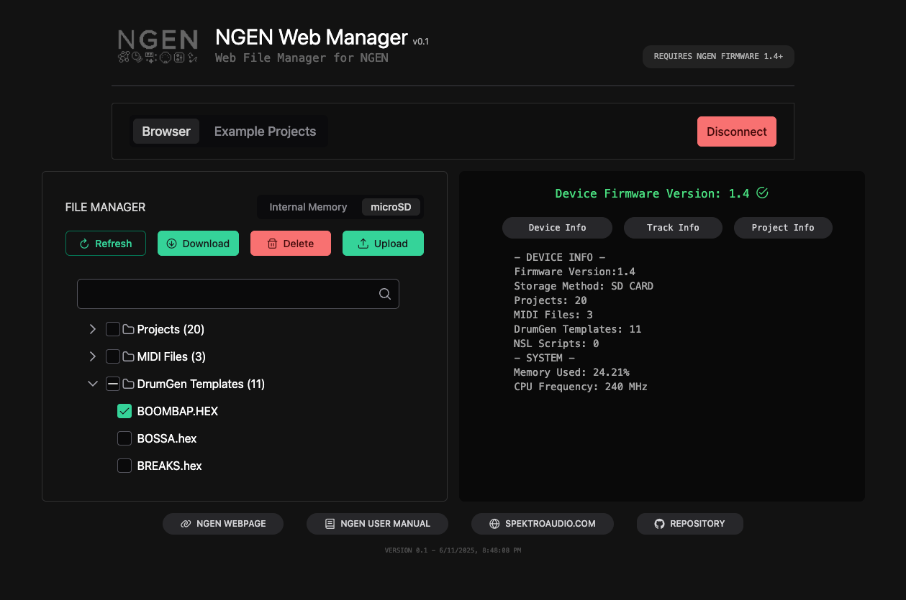

# NGEN Web Manager

A web-based tool for managing files on the [Spektro Audio NGEN](https://spektroaudio.com/ngen).

This project provides a simple, browser-based interface to manage files on an NGEN's internal memory and microSD card that connects directly to the hardware using the Web Serial API.



### 🚀 Try It Live

The hosted version is available at: **[ngen-manager.spektroaudio.com](https://ngen-manager.spektroaudio.com)**

***


### ✨ Features

* **Direct Connection:** Connect to an NGEN device right from the browser. No drivers required!
* **File Management:** Browse, upload, and download files between a computer and the NGEN's internal memory or microSD card.
* **Organize Projects:** Easily delete projects, DrumGen templates, NSL scripts, and MIDI files from the device.
* **Device Info:** Quickly check the NGEN's hardware and firmware details.
* **Get Started Fast:** Load example projects directly into an NGEN's memory.


### 📘 NGEN Resources

- [NGEN User Manual](https://ngen.spektroaudio.com)

- [NGEN Resources Repository](https://github.com/spektroaudio/NGEN-Resources)


### ✅ Requirements

To use the web manager, the following are required:

* A Spektro Audio NGEN running **firmware v1.4 or newer**.
* A browser that supports the Web Serial API (such as **Google Chrome** or **Microsoft Edge**).
* Linux Users: add your username to the **dialout** group (```sudo usermod -a -G dialout USERNAME```)

### 🔧 How It Works

This is a [Nuxt.js](https://nuxtjs.org/) application that uses [PrimeVue](https://primevue.org/) for its user interface. It communicates with the NGEN hardware by sending and receiving serial commands directly through the browser. All file operations are handled using NGEN's native command set.

### 💻 Build Instructions


**1. Clone the Repository**

```bash
git clone https://github.com/SpektroAudio/NGEN-Web-Manager.git
cd NGEN-Web-Manager
```

**2. Install Dependencies**
This project uses `npm` to manage its packages.

```bash
npm install
```

**3. Run the Development Server**

```bash
npm run dev
```

Once it's running, the application will be available at `http://localhost:3000`.

---

Spektro Audio  
[spektroaudio.com](https://spektroaudio.com)
